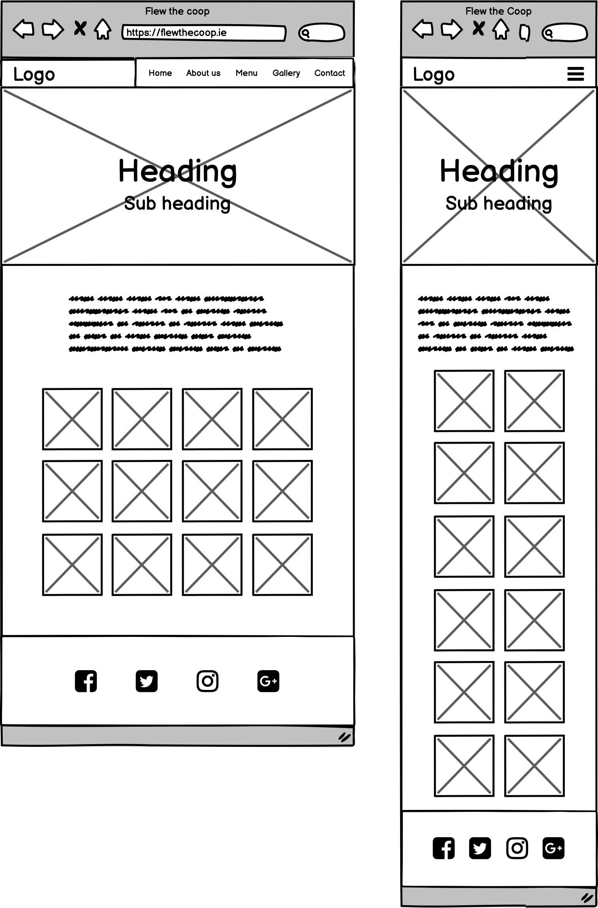
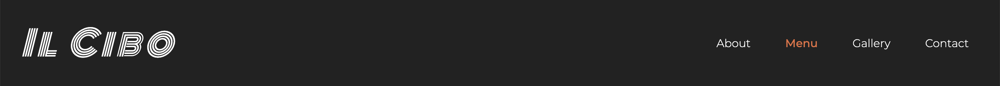
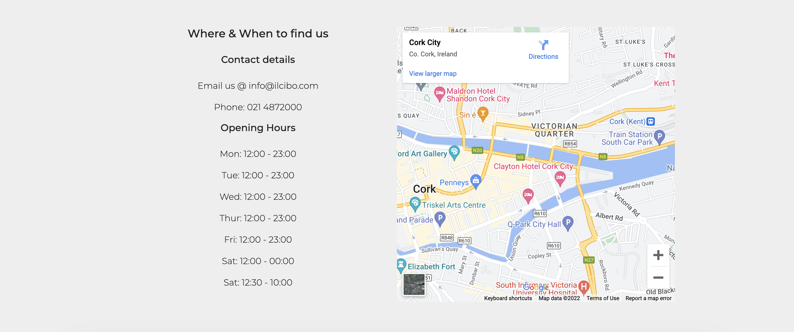

# Il Cibo
(Developer: John Constant)

[Live webpage](https://johnconstant.github.io/CI_PP1_Il_Cibo/index.html)

## Table of Content

1. [Project Goals](#project-goals)
    1. [User Goals](#user-goals)
    2. [Site Owner Goals](#site-owner-goals)
2. [User Experience](#user-experience)
    1. [Target Audience](#target-audience)
    2. [User Requrements and Expectations](#user-requrements-and-expectations)
    3. [User Stories](#user-stories)
3. [Design](#design)
    1. [Design Choices](#design-choices)
    2. [Colour](#colours)
    3. [Fonts](#fonts)
    4. [Structure](#structure)
    5. [Wireframes](#wireframes)
4. [Technologies Used](#technologies-used)
    1. [Languages](#languages)
    2. [Frameworks & Tools](#frameworks-&-tools)
5. [Features](#features)
6. [Testing](#validation)
    1. [HTML Validation](#HTML-validation)
    2. [CSS Validation](#CSS-validation)
    3. [Accessibility](#accessibility)
    4. [Performance](#performance)
    5. [Device testing](#performing-tests-on-various-devices)
    6. [Browser compatibility](#browser-compatability)
    7. [Testing user stories](#testing-user-stories)
8. [Bugs](#Bugs)
9. [Deployment](#deployment)
10. [Credits](#credits)
11. [Acknowledgements](#acknowledgements)

## Project Goals 

### User Goals
- Locate a restaurant in the heart of Cork City
- Find the restaurant's menu clearly marked with prices and dietary requirements
- Find out restaurant information such as location and opening hours
- Contact restaurant about parties or bookings
- Find out history of restaurant and information about staff

### Site Owner Goals
- Increase foot traffic
- Promote the business on site and on social media
- Allow customers to contact restaurant
- Advertise weekly specials that are not always on menu

## User Experience

### Target Audience
- Local customers looking for a new option
- Tourists visiting the area looking for a restaurant
- Groups looking for reservations or parties

### User Requrements and Expectations
- A simple website with intuitive navigation
- A way for users to easily find information about the restaurant
- Good presentation and a visually appealing design regardless of screen size
- A way to contact the business about bookings/reservations
- Relevant content that is easy to digest
- A website with accessibility best practices
- A website with good performance and quick load times

### User Stories

#### First-time User 
1. As a first time user I want to know what food the restaurant serves
2. As a first time user I want to know the prices on the food
3. As a first time user I want to know if they cater to special dietary requirements
4. As a first time user I want to know where to find the restaurant
5. As a first time user I want to know when the restaurant is open
6. As a first time user I want to know what other people think of this restaurant
7. As a first time user I would like to see the food that is served at the restaurant

#### Returning User
8. As a returning user I want to know more about the restaurant and it's staff
9. As a returning user I want to connect with the restaurant on social media
10. As a returning user I want to know how to contact the restaurant
11. As a returning user I want to contact the restaurant about a booking or reservation
12. As a returning user I want to know about any new/special dishes being served

#### Site Owner 
13. As the site owner I want to increase my social media presence and email list audience
14. As the site owner I want to advertise new dishes
15. As the site owner I want customers to being able to contact us
16. As the site owner I want to advertise when we are open

## Design

### Design Choices
I designed the site to give the user the feeling of what it is like in a busy restaurant. I want the food to be presented professionally in the images and want to emphasise the use of fresh healthy ingredients in the dishes. The images of the staff show them working happily to illustrate the love and passion they have for the job.

### Colour
I chose a dark grey and orange as the primary colours for my website and developed the site with these colours. After completing development I tested them on WebAIM to make sure the contrast between them was right. Unfortunately the contrast between my original choices was not high enough so I adjusted the shade of orange using Adobe Colour.
 

### Fonts
My font are coming in from Google Fonts and were chosen for the clean crisp look you expect from a professional kitchen and restaurant.
I used Montserrat for the body of the website and Monoton for the Logo.

### Structure
The page is structured in a well know, recognizable, user friendly, and easy to learn way. Upon arriving to the website the user sees a familiar type of navigation bar with the restaurant logo on the left side and the navigation links to the right. The website consists of five separate pages:

- A homepage with an introduction to the restaurant, menu and team.
- An about page with the About Us and Meet the Chef
- A menu page with specials and dietary restrictions clearly marked
- A image gallery with images showing off the food, restaurant and staff
- A contact page with a contact form, a map and information about the bussines section

### Wireframes

Home

About

Menu

Gallery

Contact

404

## Technologies Used

### Languages
- HTML
- CSS

### Frameworks & Tools
- Bootstrap v5.2
- GitHub
- Gitpod
- Photoshop
- Balsamiq
- Google Fonts
- Adobe Color
- Font Awsome

## Features

### Navigation

Featured on all six pages
The navbar is fully responsive and changes to a toggler (hamburger menu) on smaller screens and includes links to the About page, Menu page, Gallery and Contact us page. Clicking on the logo will bring you back to the Home page. This was done using the bootstrap v5.2 CSS and Javascript framework. It allows users to easily navigate the page, it is very simple but also highly intuitive.
The link to the current page is highlighted with orange used throughout the design.

### Home page header image
Each page is capped with a header image, title and subtitle. The picture was chosen as I felt it clearly demonstrates the purpose of the website, highlighting fresh food. The title and subtitle explains this further. The fonts were chosen as they are clean, crisp and similar fonts were used for restaurant websites in my research.

User stories covered: 1, 7

### Blurb Section
The Blurb section allows me to introduce the users to each page and gives them some more detail about the restaurant. Messages are written in an easy-going, relaxed tone of voice to illustrate the atmosphere guests can expect upon arrival to the restaurant. The font is clean and crisp. I have increased the line height to emphasise the message coming from this section.

User stories covered: 8

### Home Page Info panels
The panels on the home page allow us to redirect the user to the most important sections of the website. The first panel links to the About Page where the user is introduced to the team. The second panel brings the user to the Menu page where they can see the menu items available, their accompanying prices and dietary restrictions. Each panel contains a heading element, brief description and button. The button has a hover and active state supplying the user with the expected feedback. The panels stack with the image over the text on tablet and mobile screens.

User stories covered: 1, 7, 8

### Review Carousel
The home page has a carousel which contains past visitors reviews about the restaurant. The carousel was created using Bootstrap v5.2 and contains controls to move the slides forwards and backwards as well as an indicator below as to which slide you are currently viewing. The slides will move themselves after a specified amount of time if the user does not interact with it.

User stories covered: 6

### Newsletter Sign Up Form

At the bottom of the home page the user can sign up to monthly email list using a Sign Up form. The image indicates the type of content you might receive by illustrating a special dish. The form contains basic validation on it's inputs and cannot be submitted without the required fields. Each field supplies the user with feedback about which field is being utilised.

User stories covered: 13

### Footer

Each of the pages contains a footer navigation with links to the restaurant's social media accounts. The links consist of the particular social media site's icon and a hover effect in the social media sites colour. Each link contains an aria-label to account for the lack of text within the link to increase accessibility.

User stories covered: 9, 13

### Meet the Chef
The About Page contains a section about the chef. This includes two panels, one with an image and the other with further information about the chef. This expands on the information available from the home page info panel. The panels stack with the image over the text on tablet and mobile screens.

User stories covered: 1, 8

### Our Team
The About Page contains a section about our team/staff. This includes two panels, one with an image and the other with further information about the staff. This allows the user to find out more about the staf and the standards the restaurant keeps.The panels stack with the image over the text on tablet and mobile screens.

User stories covered: 8

### Menu
The menu page clearly lists all of the items on offer at any given time. Prices are clearly listed alongside the respective item. Items with special dietary restrictions are marked with a relevant icon. This menu is fully responsive. On mobile it collapses into accordion sections to avoid excessive scrolling for the user and improve the user experience. 

User stories covered: 1, 2, 3,

### Specials Panel
The menu page also contanis a panel for advertising the daily/weekly special. The panel allows for the inclusion of an image to illustrate new dishes to guests. The price and description are clearly marked. This panel can be added and changed as many times as necessary. A second instance of the panel exists on the page for the Chef's recommendation.

User stories covered: 1, 2, 3, 7, 12, 14

### Image Gallery

The gallery page contains images on the restaurant, food being made and the restaurant itself. This helps to illustrate the quality of the food, the fact that the food is hand made and the atmosphere within the restaurant. The gallery is fully responsive and the images columns decrease as the screen size does.

User stories covered: 1, 7

### Opening Hours

On the contact page the user can find information about how to contact us such as the phone number, address and email address if they would like to contact us directly. It also has an area with the Opening Hours to let them know when we are open.

User stories covered: 4, 5, 10, 16

### Map

I have also embedded a Google map on the contact page providing guests not familiar with the city or location with a way to find the restaurant. The map is fully interactive allowing guests to scroll, zoom and even get directions from their current location.

User stories covered: 4

### Contact Form

The contact page also includes an additional form should the guest want to contact us through the website. This gives the guest an alternative way of contacting the restaurant apart from traditional methods such as phone or email.

User stories covered: 10, 11, 15

## Validation

### HTML Validation
The W3C Markup Validation Service was used to validate the HTML of the website. All pages pass with no errors no warnings to show.

Home

About

Menu

Gallery

Contact

404

### CSS Validation
The W3C Jigsaw CSS Validation Service was used to validate the CSS of the website.
I validated by URL and through a file upload oy my style.css file and passed bith tests with no errors.

whole page

style.css

### Accessibility
I used the Wave Accesibility Evaluation Tool to validate the pages for accessibility issues. I validated each page without any errors and only 1 reported warning

The W3C Markup Validation Service was used to validate the HTML of the website. All pages pass with no errors no warnings to show.

Home

About

Menu

Gallery

Contact

404

### Performance 
Google Lighthouse in Google Chrome Developer Tools was used to test the performance of the website.

### Performing tests on various devices 
The website was tested on the following devices:

- MacBook Pro
- Dell on latest Windows OS
- Nord One Plus

In addition, the website was tested using Google Chrome Developer Tools Device Toggeling option for all available device options.

### Browser compatability
The website has also been tested in the following browsers.

- Google Chrome
- Safari
- Firefox
- Microsoft Edge
- Android Native Browser
- Google Chrome on Android

### Testing user stories

## Bugs

| **Bug** | **Fix** |
| ----------- | ----------- |
| Instagram footer link transition not working | Bug remains unfixed |
| Info panel button icon transition not working | Bug remains unfixed |

## Deployment
In the GitHub repository navigate to the Settings tab
1. On the left hand menu select Pages
2. For the source select Branch: main
3. After the webpage refreshes automaticaly you will see a ribbon on the top saying: "Your site is published at https://johnconstant.github.io/CI_PP1_Il_Cibo/index.html"

You can for fork the repository by following these steps:

1. Go to the GitHub repository
2. Click on Fork button in upper right hand corner

You can clone the repository by following these steps:

1. Go to the GitHub repository
2. Locate the Code button above the list of files and click it
3. Select if you prefere to clone using HTTPS, SSH, or Github CLI and click the copy button to copy the URL to your clipboard
4. Open Git Bash
5. Change the current working directory to the one where you want the cloned directory
6. Type git clone and paste the URL from the clipboard ($ git clone https://github.com/YOUR-USERNAME/YOUR-REPOSITORY) 7.Press Enter to create your local clone.

## Credits

### Media
I got my images from Pexels.com and the menu panel image on the home page from Shutterstock. I used icons from Font Awesome.
  
### Code
- Hamburger style navigation comes from the Bootstrap v5.2 CSS and Javascript framework
- Home page reviews carousel was done the CSS and Javascript framework, Bootstrap v5.2
- My form styling came from a Udemy course, (Advanced CSS and SASS)[https://www.udemy.com/course/advanced-css-and-sass/], by Jonas Schmedtman
- Removing the form labels in an accessible way came from (CSS Tricks)[https://css-tricks.com/html-inputs-and-labels-a-love-story/]
- The Instagram gradient colours were taken from (Stack Overflow)[https://stackoverflow.com/questions/37751375/instagram-new-logo-css-background] and applied using another tutorial on (CSS Tricks)[https://css-tricks.com/snippets/css/gradient-text/]
- The menu page when displayed on mobile came from (CodePen)[https://codepen.io/owlsky/pen/nXZaLJ] courtesy of Owlsky

## Acknowledgements
I would like to thank my mentor, Mohammad Shami, for all of his help and guidance during this project.
